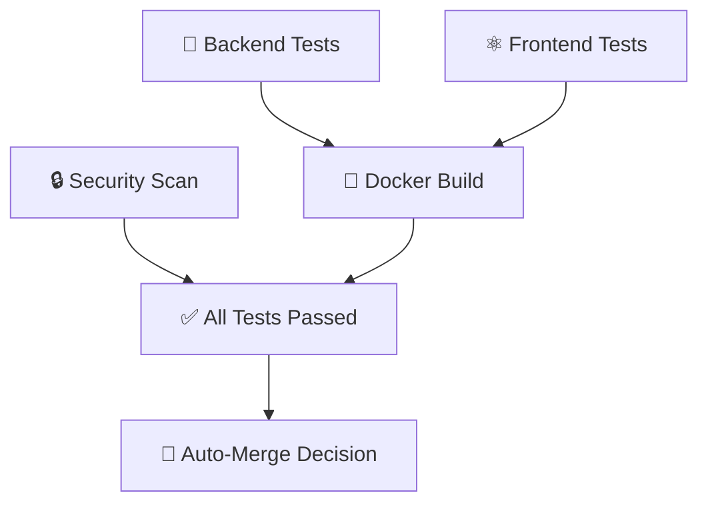

# 🚀 CI/CD Setup Guide

This guide explains how to set up and use the automated testing and deployment pipeline for MealLens AI.

## 🏗️ What's Included

### ✅ Automated Testing Pipeline
- **Backend Tests**: Python/Flask unit tests with pytest
- **Frontend Tests**: React/TypeScript tests with Vitest
- **Code Quality**: Linting and formatting checks
- **Security Scans**: Vulnerability scanning with Trivy
- **Docker Build**: Container build verification
- **Coverage Reports**: Automated coverage reporting

### 🤖 Auto-Merge System
- **Smart Merging**: Automatically merges PRs when all tests pass
- **Label-Based**: Control with `auto-merge`, `dependencies`, or `hotfix` labels
- **Safety First**: Only merges if all CI checks are green

### 📦 Dependency Management
- **Dependabot**: Automatic dependency updates
- **Auto-Merge**: Dependency PRs auto-merge if tests pass
- **Weekly Schedule**: Updates every Monday

## 🛠️ Setup Instructions

### 1. 🔒 Enable Branch Protection (Required)

**Go to GitHub Repository Settings > Branches > Add rule for `main`:**

```yaml
Branch Protection Settings:
✅ Require a pull request before merging
✅ Require approvals: 1 (or 0 for personal projects)
✅ Dismiss stale PR approvals when new commits are pushed
✅ Require review from code owners
✅ Require status checks to pass before merging
✅ Require branches to be up to date before merging
Required Status Checks:
  - ✅ All Tests Passed
  - 🐍 Backend Tests
  - ⚛️ Frontend Tests
  - 🐳 Docker Build Test
  - 🔒 Security Scan
✅ Require conversation resolution before merging
✅ Include administrators
```

### 2. 🏷️ Create GitHub Labels

**Create these labels in GitHub Issues > Labels:**

```yaml
Labels to create:
- auto-merge (color: #28a745)
- dependencies (color: #0366d6)
- hotfix (color: #d73a49)
- frontend (color: #61dafb)
- backend (color: #3776ab)
- docker (color: #2496ed)
- github-actions (color: #2088ff)
```

### 3. ⚙️ Configure Repository Settings

**Settings > General > Pull Requests:**
- ✅ Allow squash merging
- ✅ Allow auto-merge
- ✅ Automatically delete head branches

**Settings > Actions > General:**
- ✅ Allow GitHub Actions to create and approve pull requests

## 🔄 How to Use

### 📝 Creating a Pull Request

1. **Create a feature branch:**
   ```bash
   git checkout -b feature/your-feature-name
   ```

2. **Make your changes and commit:**
   ```bash
   git add .
   git commit -m "✨ Add new feature"
   git push origin feature/your-feature-name
   ```

3. **Create PR on GitHub:**
   - Use the provided PR template
   - Add appropriate labels for auto-merge if desired

### 🤖 Enabling Auto-Merge

**Add one of these labels to your PR:**
- `auto-merge` - General changes
- `dependencies` - Dependency updates
- `hotfix` - Critical fixes

**The system will:**
1. ⏳ Wait for all CI checks to complete
2. ✅ Auto-merge if all tests pass
3. 💬 Comment with success/failure status
4. 🗑️ Auto-delete the branch

### 🧪 Running Tests Locally

**Backend Tests:**
```bash
cd backend
python -m pytest --cov=. --cov-report=term-missing
```

**Frontend Tests:**
```bash
cd frontend
npm test
npm run test:coverage
```

**Code Quality:**
```bash
# Backend
cd backend
black . --check
flake8 .

# Frontend
cd frontend
npm run lint
npm run format:check
```

## 📊 CI/CD Workflow Details

### 🔄 Triggers
- **Push to main/develop**: Full CI pipeline
- **Pull Requests**: Full CI pipeline + auto-merge check
- **Dependency updates**: Automatic via Dependabot

### 🏃‍♂️ Jobs Execution Order


### ⚡ Performance Optimizations
- **Caching**: Dependencies cached for faster builds
- **Parallel Execution**: Tests run simultaneously
- **Incremental Builds**: Only changed components rebuild

## 📈 Monitoring & Alerts

### 📊 Coverage Reports
- Automatically uploaded to Codecov
- Visible in PR comments
- Tracks coverage trends

### 🚨 Failure Notifications
- GitHub notifications for failed builds
- PR comments with failure details
- Email alerts for critical failures

## 🐛 Troubleshooting

### ❌ Common Issues

**Tests failing locally but passing in CI:**
```bash
# Clear caches and reinstall
rm -rf node_modules frontend/node_modules
npm install
cd frontend && npm install
```

**Auto-merge not working:**
1. Check branch protection rules are enabled
2. Verify required status checks are configured
3. Ensure proper labels are applied
4. Check if all required checks are passing

**Coverage reports not uploading:**
1. Verify tests generate coverage files
2. Check Codecov token configuration
3. Ensure coverage files are in correct format

### 🔧 Manual Override

**Force merge without waiting for CI:**
1. Add `ci-skip` label to PR
2. Admin users can bypass restrictions
3. Use GitHub CLI: `gh pr merge --squash`

## 🚀 Advanced Features

### 📱 Mobile App Support
Ready for React Native CI/CD when mobile app is added.

### 🌐 Multi-Environment Deployment
Supports staging/production environment workflows.

### 🔐 Security Integration
- Vulnerability scanning
- Dependency security checks
- Code security analysis

### 📊 Performance Monitoring
- Build time tracking
- Test execution metrics
- Resource usage monitoring

## 🆘 Support

**Need help?**
1. Check GitHub Actions logs
2. Review this documentation
3. Create an issue with `ci-cd` label
4. Contact the development team

## 👥 MealLens AI Team

**Developed by:**
- **🎯 CEO & AI Engineer**: Daniel Etekudo - AI innovation and strategic vision
- **💻 CTO & Full-Stack Developer**: Oluu Graham - Technical leadership and full-stack development

---

**🎉 Happy Coding with Automated CI/CD!** 🚀

**Built with ❤️ by Daniel Etekudo & Oluu Graham**